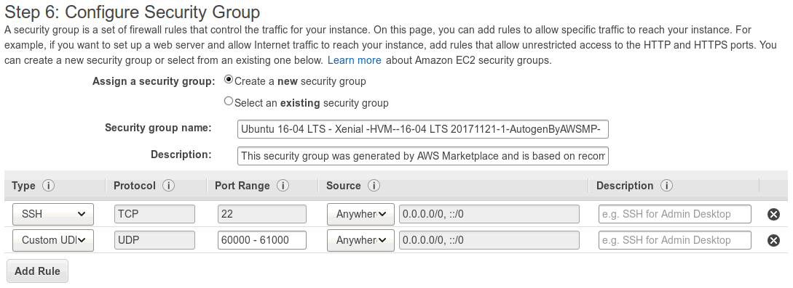
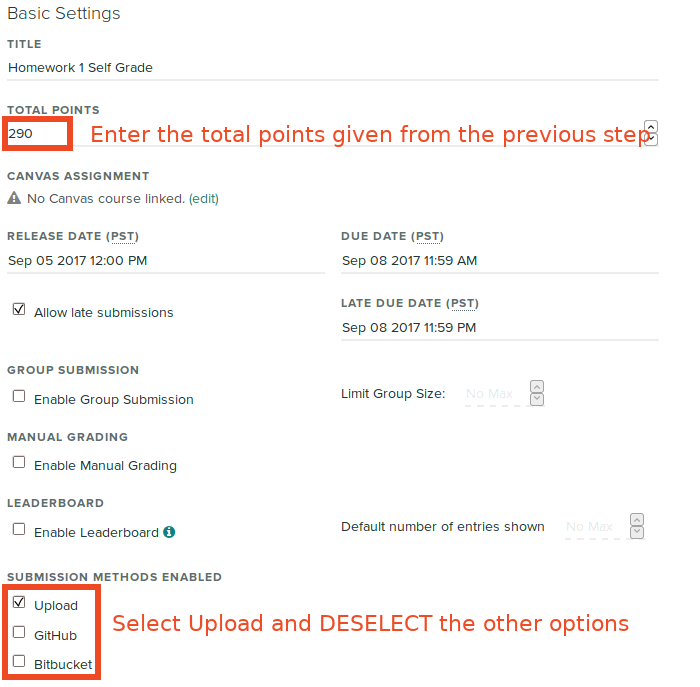

Course Robot (New Course Manager for Gradescope)
================================================

# Setup

1. Start a new AWS instance with **Ubuntu 17.10**. It may also work on other versions though it has not been tested with other versions. Make sure to enable SSH (port 22) and mosh (port 60000-61000 UDP). We recommend at least 10GB of disk space. 
2. Copy the the course robot private key (`id_rsa`) and credentials file (`credentials.sh`) to the instance: (example) `scp id_rsa credentials.sh ubuntu@<instance IP>:~/`
3. SSH into the instance.
4. Clone this repo and enter it: `cd ~; git clone https://github.com/ee16b/courserobot.git && cd courserobot`
5. Copy the user credentials file and modify it: `cp user_credentials.sh.template ~/user_credentials.sh; vim ~/user_credentials.sh`. This is required in order to set up the infrastructure on Github.
6. Copy the general settings file and modify it: `cp general.yaml.template ~/general.yaml; vim ~/general.yaml`. Be sure to update at least the semester tag (see below for what this is) and `piazza_id`.
7. Run `sudo ./setup.sh` ONCE to initialize everything.

# Pre-Course Setup

Note: when the instructions refer to the "release repo", they mean the www-src folder corresponding to your semester (e.g. https://github.com/ee16b/fa17-www-src for fall 2017).

## First Steps

Edit `common.csv` and update the semester, year, and week zero start date (see the comment field for an example).

## Piazza

Invite the course robot account (likely `course.manager.ee16 AT gmail.com`, replace `AT` with `@`) to join the class on Piazza as a TA (under "Enroll Professors/TAs").

## GSI/Professor Pictures

1. Obtain pictures from each TA on Slack.
2. Crop to square ratio.
3. Resize to about 1000x1000px, with quality of about 80 to save space.
4. Place the pictures into `images/` of the release repo.
5. For GSIs, edit `gsi_list.csv` following the existing pattern. For example, if Bob's picture is at `images/bob.jpg` in the release repo, then the picture column should contain "bob.jpg". For professors, edit `profs_list.csv`.
6. Push to the release repo.

Follow the instructions for "Manual Changes" below to make them visible on the website.

# User Guide

## Manual Changes

To push manual changes to the release repo, SSH into the cours robot backend and run:

```shell
update_repos.py inst
```

## Schedule

Edit `schedule.csv` to update the main schedule on the website.

* To make a **discussion** appear on the schedule, type in "yes" for the "link?" column under that week (e.g. "Discussion A link?"). Make sure you followed the steps below to upload it to the website.
* To make a **lab** appear, add its zip file to the `lab/` folder in the release repo and type in its name under the "Lab link" column.
* To make **lecture notes** appear, add a PDF file under `lec/` in the release repo and put "yes" under the column (e.g. "Lecture A link?").

  Example: for lecture 5A, add `lec/Lecture5A.pdf` to the release repo and put "yes" under the "Lecture A link?" column for week 5.

  Likewise, to make the lecture notes appear for lecture 5A, add `lec/Lecture5A_notes.pdf` to the release repo and put yes under the "Lecture A notes link?" column for week 5.
* To make **lecture videos** appear, put the full YouTube link under that column (e.g. "Lecture A video").

## Calendar

Ask the previous web/head TAs to share the Google Calendar with you. It should populate automatically.

## Homework

### Step 1: Homework YAML

In each homework directory where the latex files are stored (example: `[ee16b-content repo]/sp18/hws/1/info.yaml`), ensure that there exists an **info.yaml** file with:

```
questionParts: [a, a, b, b, c, a]
optionalParts: ["3a", 4]
```

This indicates that the homework consists of 1a, 2a, 3a-b, 4a-b, 5a-c, 6a. If there are no sub-parts to a problem, we will just call it #a on the self grader. Optional parts can be specified as # only (i.e. 2 should not be graded) or as a string "2a", which indicates that 2a should not be graded. If, for example, you don't want 3a and 4b to be graded, you should specify `optionalParts: ["3a", "4b"]`.

### Step 2: Releasing Homework

SSH into the course robot and run the following commands, adding the homework number as shown below.

```shell
update_repos.py content_repos
homework_interface.py [hw_num] make_homework
```

Example: to release homework 1:

```shell
update_repos.py content_repos
homework_interface.py 1 make_homework
```

This will push the homework out to the website and to Piazza. Simply re-run the commands to update homework.

### Step 3: Gradescope Assignment

At the end of the previous step, the system will ask you to create a Gradescope assignment to allow students to submit their homework. Follow the directions and create an assignment with the appropriate deadlines.

```
****************************
Homework 1 released
If you haven't already, please create a Gradescope assignment titled exactly "Homework 1" worth 230 points.
****************************
```

## Solutions and Self-Grades

### Step 1: Releasing Solutions and Self-Grades

SSH into the course robot and run the following commands, adding the homework number as shown below.

```shell
update_repos.py content_repos
homework_interface.py [hw_num] make_solutions
```

Example: to release homework 1 solutions and self-grades:

```shell
update_repos.py content_repos
homework_interface.py 1 make_solutions
```

This will push the solutions and self-grade form to the website and to Piazza. Simply re-run the commands to update homework.

### Step 2: Gradescope Assignment

As above, you'll need to create the self-grade assignment:

```
****************************
Homework 1 solutions released
If you haven't already, please create a Gradescope 'Programming Assignment' titled exactly "Homework 1 Self Grade" worth 290 points.
You can find the autograder .zip here: http://inst.eecs.berkeley.edu/~ee16b/fa17/hw_autograder/autograder1-290.zip
****************************
```

From the "Assignments" page of the course on Gradescope, click "Create Programming Assignment" near the bottom right. Download and select the autograder .zip given from the end of the last step and follow the directions.

Once the assignment has been created, be sure to enter the total points and select only "Upload" as a submission method.



## Discussions

### Releasing Discussions

Replace 0B with the correct discussion number - e.g. discussion 4A -> replace 0B with 4A.

```shell
update_repos.py content_repos
discussion_interface.py 0B make_discussion
```

Make sure to edit the schedule as described above to make the link to the discussion visible on the website.

### Releasing Answers

Replace 0B with the correct discussion number - e.g. discussion 4A -> replace 0B with 4A.

```shell
update_repos.py content_repos
discussion_interface.py 0B make_answers
```

# Troubleshooting

- Make sure that repos don't have uncommited changes.

# Info

## Semester tags

Examples:
- Fall 2017 -> fa17
- Spring 2018 -> sp18
- Fall 2018 -> fa18
- Spring 2019 -> sp19
- Summer 2019 -> su19
- Fall 2019 -> fa19

# TODO

- TODO: create zip files for lab automatically
- TODO: update/generate homework.php
- TODO: use Gradescope API to automate creating assignments
